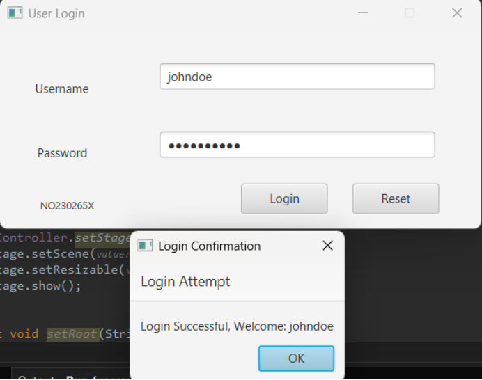
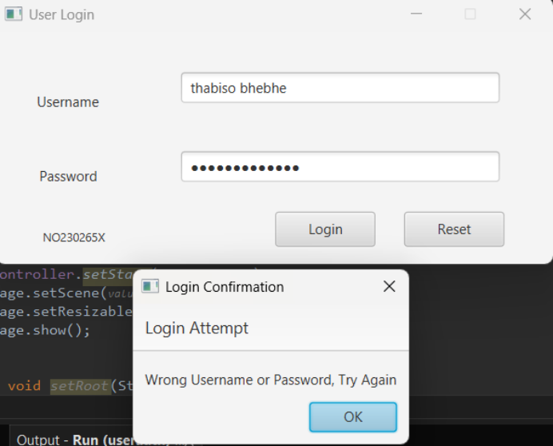
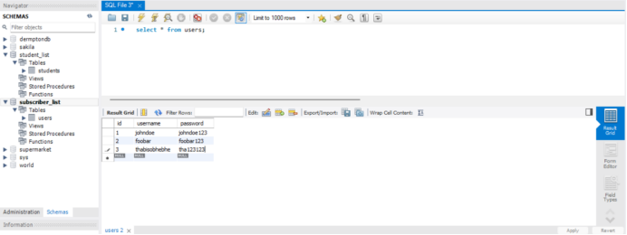

# JavaFX User Login Authentication

A simple desktop login system built with JavaFX, MySQL, and Java 11. This demo application authenticates users by validating credentials stored in a MySQL database.

> Project originally built as part of a Java coursework assignment using MVC architecture.

---

## Features

- JavaFX UI with username/password input
- Password-protected login via MySQL database
- Reset button to clear inputs
- Dialog popup on success/failure
- MVC pattern: Model, View (FXML), Controller
- Modular with `module-info.java` and Maven build

---

## Tech Stack

- Java 11 / JavaFX 20
- MySQL 8.x
- Maven
- FXML (for layout)
- JavaFX Maven Plugin
- SceneBuilder

---

## Folder Structure

src/ <br>
├── com.dermpton.userauth <br>
│ ├── App.java <br>
│ ├── UserController.java <br>
├── com.dermpton.userauth.model <br>
│ └── User.java <br>
├── com.dermpton.userauth.data <br>
│ ├── AppQuery.java <br>
│ └── DataSource.java <br>
└── resources/ <br>
└── user.fxml <br>

---

## Getting Started

### Prerequisites

- JDK 11 or higher
- MySQL installed locally
- Maven

### Step 1: Clone the Repo

```bash
git clone https://github.com/dermpton/simple-java-login.git
cd simple-java-login
```

### Step 2: Setup MySQL

```
CREATE DATABASE subscriber_list;
USE subscriber_list;

CREATE TABLE users (
  id INT PRIMARY KEY AUTO_INCREMENT,
  username VARCHAR(255) NOT NULL,
  password VARCHAR(255) NOT NULL
);

INSERT INTO users (username, password) VALUES
('admin', 'admin123'),
('user1', 'password1'),
('user2', 'password2');
```
<br>

### Step 3: Update DB Credentials
In `DataSource.java`, edit the line:<br>

```
DriverManager.getConnection("jdbc:mysql://localhost/subscriber_list", "root", "YOUR_PASSWORD");
```

### Step 4: Run the App

```
mvn clean javafx:run
```

## Screenshots

 <br>

 <br>

 <br>